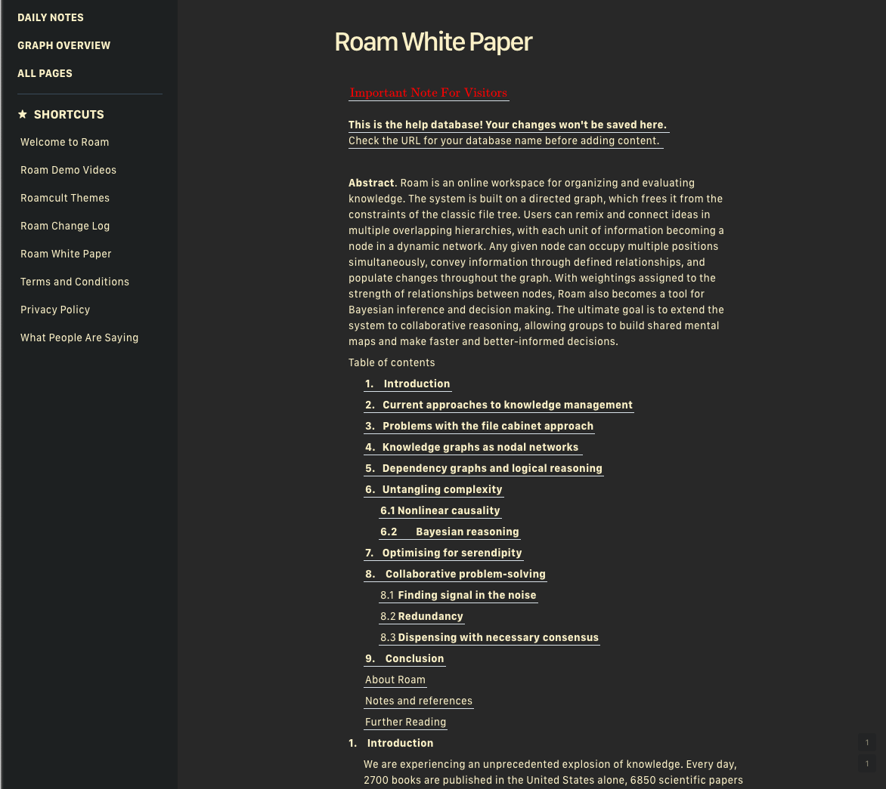

# Roam Research Themes

## Install

Create a page called [[roam/css]] in your roamresearch workspace, adding a code block on css, and using the single line to import the theme. `@import url('https://imjma.github.io/roam-research-themes/gruvbox-dark.css');`

[Video Applying Custom Themes for your Roam Research with [[roam/css]]](https://www.youtube.com/watch?v=UY-sAC2eGyI)  
[SF Compact and SF Mono fonts](https://developer.apple.com/fonts/)

## [Gruvbox Dark](./gruvbox-dark.css)

`@import url('https://imjma.github.io/roam-research-themes/gruvbox-dark.css');`

**WIP**

- [ ] Code Block
- [ ] Tweet Embed
- [ ] Icon color

[Gruvbox](https://github.com/morhetz/gruvbox) is one of my favorite color schemes.

 
